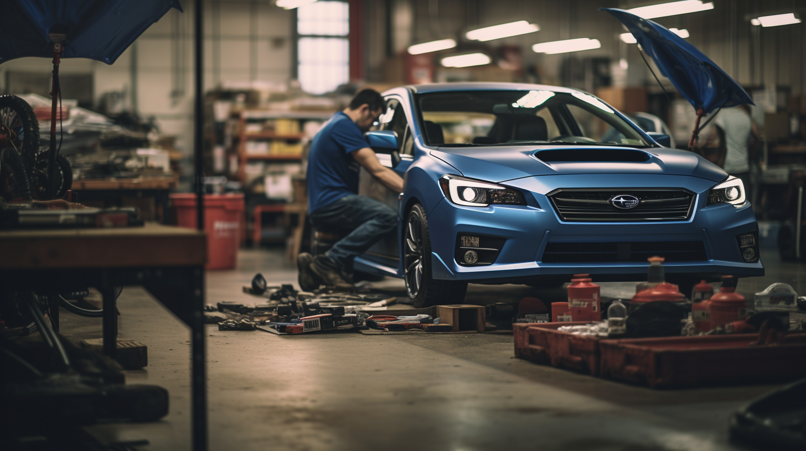

Nestled in the heart of a community that values exceptional automotive performance and reliability, Rigo Built Garage stands as a beacon for Subaru enthusiasts and car owners alike. Here, the roar of engines blends with the clink of tools, and the air is thick with the spirit of craftsmanship. This is a place where vehicles are not just repaired but are given a new lease on life. Join us as we take you through a day in the life at Rigo Built Garage, where passion meets precision in the art of car care.

## Morning: The Symphony Begins

As the garage doors roll open, the morning light spills onto a floor lined with Subarus awaiting attention. The mechanics arrive, their faces set with determination and a hint of excitement for the day's challenges. The first order of the day is a team huddle, a tradition at Rigo Built Garage, where the day's tasks are distributed, and strategies are discussed. It's not just about the work; it's about building a rhythm, a synchronized effort to ensure that every car is given the attention it deserves.

## Mid-Morning: Diagnostics and Discoveries

The hum of diagnostic machines punctuates the air as the team delves into the heart of each Subaru, uncovering the stories behind every rattle and hum. Today, a WRX STI is on the lift, its owner concerned about an unusual noise from the engine bay. With methodical precision, the mechanics at Rigo Built Garage work to diagnose the issue, their expertise shining through as they pinpoint a failing bearing. It's a discovery that speaks to the value of experience and the importance of a keen ear.

## Lunch: A Brief Respite

Even the most dedicated mechanics need a moment to recharge. Lunchtime is a communal affair, with stories and laughter shared over sandwiches and coffee. It's a chance to step back and bond, to remember that this garage is more than a workplace—it's a family. But even as they rest, their minds are never far from the cars that await, and conversations often turn to discussions of the latest automotive technologies and repair techniques.

## Afternoon: The Dance of Repair and Restoration

The afternoon is a ballet of movement: wrenches turn, wheels are aligned, and engines are tuned. A vintage Subaru Brat is in for a full restoration, a project that has the whole garage buzzing with anticipation. As the body is sanded down, ready for a new coat of paint, there's a sense of bringing history back to life, of preserving the legacy that Subaru has built over the years.

## Late Afternoon: The Final Touches

As the day winds down, the focus shifts to the finishing touches. Cars are test-driven, cleaned, and polished. The WRX STI, now purring like a kitten, is taken for a final test drive. It's a moment of truth, where the work of the day meets the road, and satisfaction is found in a job well done.

## Evening: Closing Time

The tools are cleaned and put away, the floors are swept, and the lights are dimmed. The team gathers once more, this time to reflect on the day's successes and the lessons learned. As the garage doors close, there's a sense of accomplishment—a feeling that, in a day's work, they've not just repaired cars, but they've kept the passions of their customers alive.

## Conclusion: More Than Just a Garage

Rigo Built Garage is more than just a place where cars are fixed. It's a hub of expertise, a community center for car lovers, and a home for those who put their heart into their work. Behind the scenes, every day is a story of dedication, a testament to the team's commitment to excellence. And as each car rolls out, ready for the road ahead, it carries with it the spirit and skill of the mechanics who made it whole again.

---

This blog post aims to capture the essence of a day at Rigo Built Garage, highlighting the dedication and expertise that goes into each repair and restoration. It's a story that not only Subaru owners but all car enthusiasts can appreciate. For a more interactive experience, consider adding a video or photo diary of a day at the garage, or feature customer testimonials to bring the narrative to life.
