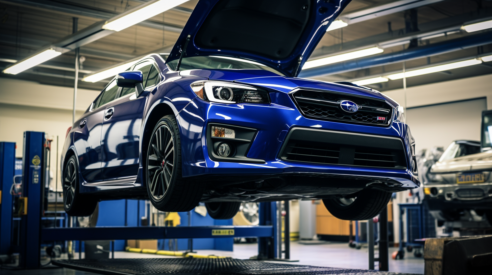
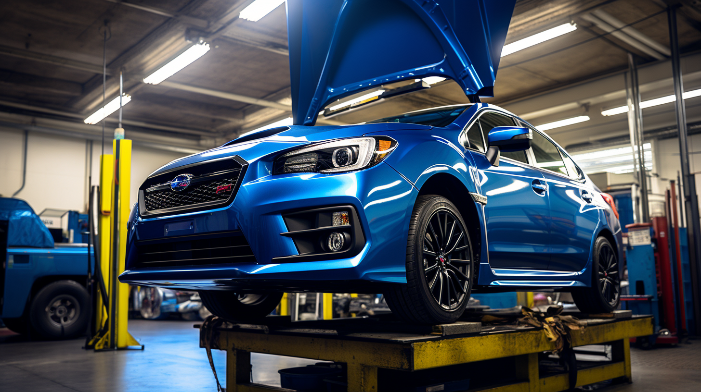
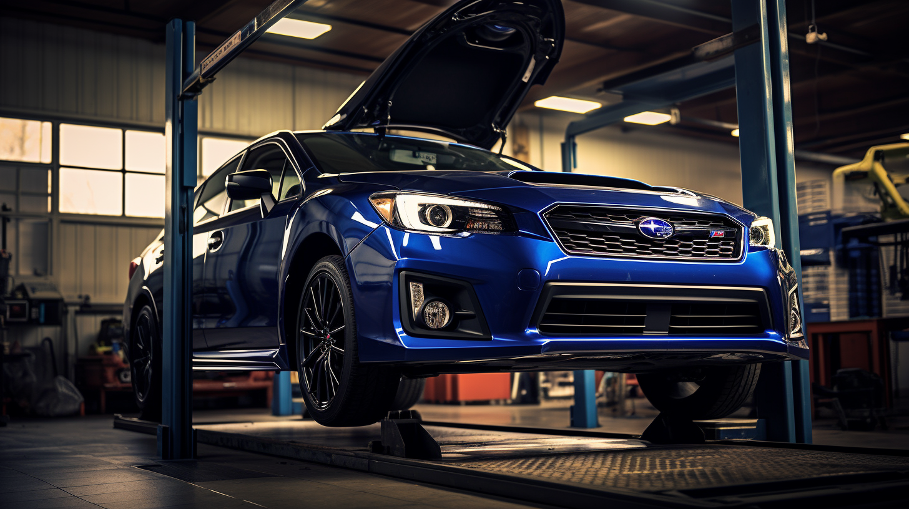

Subaru vehicles are known for their durability and all-terrain capability, making them a top choice for drivers who demand reliability in all conditions. However, even the sturdiest of vehicles require regular maintenance to keep them running smoothly. As experts in Subaru care, we've compiled essential tips to help you maintain your Subaru and ensure it continues to provide the safe and enjoyable driving experience you've come to expect.

## Regular Oil Changes: The Lifeline of Your Engine

The most fundamental aspect of vehicle maintenance is the regular oil change. For Subaru vehicles, which often house turbocharged engines, the right type of oil and timely changes are crucial. Depending on your model and the oil used, change intervals can vary. However, a good rule of thumb is every 6,000 miles for conventional oil or every 10,000 miles for synthetic. Remember, clean oil ensures minimal friction and wear on the engine components, keeping your Subaru's heart healthy.

## Tire Maintenance: Your Contact with the Road

Subarus are known for their impressive all-wheel-drive system, but it's the tires that make the first contact with the road. Regularly check your tire pressure to ensure optimal performance and fuel efficiency. Rotate your tires every 6,000 to 8,000 miles to promote even wear and extend their life. Don't forget to have your alignment checked periodically, especially if you notice any uneven tire wear or if the vehicle pulls to one side.

## Brake Care: Stopping Power When You Need It

The brake system is a critical safety feature, and its maintenance is non-negotiable. For Subarus, which may be used in various driving conditions, ensuring that your brakes are always in top condition is essential. Listen for any unusual noises when braking, and have your pads and rotors checked regularly. If you're adventurous and often drive on hilly terrain or carry heavy loads, consider upgrading to high-performance brake pads that can handle the extra heat and stress.

## Fluid Checks: Beyond Just Oil

While oil is vital, other fluids require attention too. Regularly check your Subaru's transmission fluid, brake fluid, coolant, and power steering fluid. These fluids should be at the proper levels and changed according to the manufacturer's recommendations. Remember, old or contaminated fluids can lead to poor performance and even costly repairs.

## Battery Health: The Spark of Life

A dead battery can leave you stranded at the most inconvenient times. Check your Subaru's battery health, especially before winter, as cold weather can reduce its efficiency. Ensure the terminals are clean and free from corrosion, and that the battery is securely mounted. Most batteries last between 3-5 years, so keep track of its age and have it tested regularly.

## Air Filters: The Lungs of Your Subaru

Your Subaru's engine and cabin air filters play a significant role in performance and comfort. A clogged engine air filter can reduce fuel efficiency and power, while a dirty cabin air filter can affect the air quality inside your vehicle. Check these filters every 12,000 to 15,000 miles and replace them as needed to keep your Subaru breathing easily.

## Conclusion: The Reward of Regular Maintenance

Maintaining your Subaru is an investment in its longevity and performance. By following these expert tips, you can ensure that your vehicle remains reliable, safe, and enjoyable to drive for many years to come. Regular maintenance not only prevents unexpected breakdowns but also maintains the value of your Subaru should you decide to sell it in the future.

Remember, while some maintenance tasks can be done at home, others should be performed by a professional. Trust your Subaru to a certified mechanic who knows your vehicle inside and out and can provide the specialized care it deserves.

Drive confidently, knowing that with proper care, your Subaru will continue to take you on countless adventures, from city streets to mountain peaks.

---

This blog post is designed to provide Subaru owners with practical advice on maintaining their vehicle. Each section could be expanded with more detailed information, including how-to guides, the importance of using genuine Subaru parts, and the intervals for specific maintenance tasks based on different Subaru models and driving conditions.
