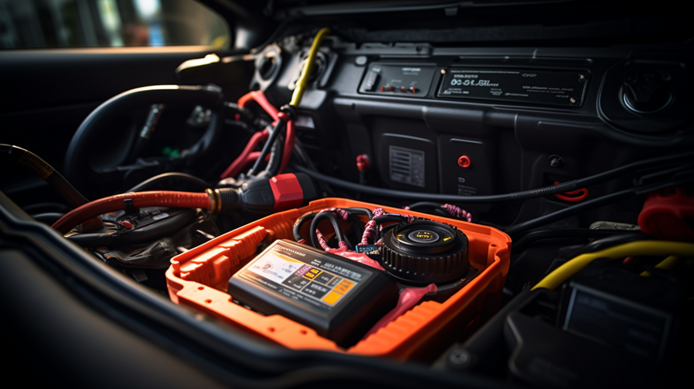

Subaru vehicles are known for their rugged durability and all-wheel-drive capabilities, making them the go-to choice for drivers who face challenging weather conditions or love off-road adventures. However, like all vehicles, Subarus have their set of common issues that owners may encounter over time. Understanding these problems and knowing how to address them can save you time and money. Here’s a rundown of some typical Subaru repairs and how to solve them effectively.

## Head Gasket Leaks: The Achilles' Heel

One of the most well-known issues with older Subaru models, particularly the 2.5-liter engines, is head gasket leaks. Symptoms often include overheating, white smoke from the exhaust, and a distinct smell of antifreeze. The solution is a professional head gasket replacement, which should include resurfacing the heads to ensure a proper seal. While this repair can be costly, addressing it promptly can prevent more severe engine damage.

## Oil Consumption: Keeping an Eye on the Dipstick

Some Subaru drivers may notice their cars consume oil faster than expected. This issue can be particularly prevalent in models from the early 2010s. If you find yourself adding oil frequently between changes, it's essential to have your vehicle checked. Solutions may range from updating the engine's firmware (if it's a software issue) to replacing piston rings, which is a more significant repair.

## CVT Transmission: Smooth Sailing or Rough Waters?

Continuously Variable Transmissions (CVTs) in Subarus provide a smooth driving experience and improved fuel efficiency. However, some drivers have reported issues such as shuddering, hesitation, or even failure. Regular CVT fluid changes can help maintain the transmission's health, but if problems persist, it may require a professional diagnosis and, in some cases, a transmission replacement.

## Suspension Noises: The Sounds of Wear

Subarus are built to handle rough terrain, but their suspensions can still wear out over time. Common signs of suspension issues include clunking noises, uneven tire wear, or a rough ride. Regular inspections can catch problems early, and solutions often involve replacing worn-out components like bushings, struts, or sway bar links.

## Electrical Gremlins: Dimming the Lights

Subaru owners sometimes report various electrical issues, from flickering lights to malfunctioning windows. These problems can often be traced back to a weak battery or failing alternator. Regular electrical system checks can identify these issues early, and solutions typically involve replacing the faulty components before they lead to more significant problems.

## Conclusion: Proactive Care for Your Subaru

While Subarus are as tough as they come, they're not immune to wear and tear. Being aware of common issues and addressing them proactively is key to maintaining your vehicle's performance and reliability. Regular check-ups, using genuine parts, and trusting repairs to experienced mechanics will ensure that your Subaru continues to take you on countless adventures without a hitch.

Remember, the key to a healthy Subaru is not just reacting to problems as they arise but preventing them from happening in the first place. With proper care and maintenance, your Subaru will be ready for whatever the road—or off-road—throws your way.

---

This blog post is designed to inform Subaru owners about common issues they may face and to provide guidance on how to address them. For a more engaging post, consider adding real-life case studies, owner interviews, or even a Q&A section where readers can submit their Subaru questions.
