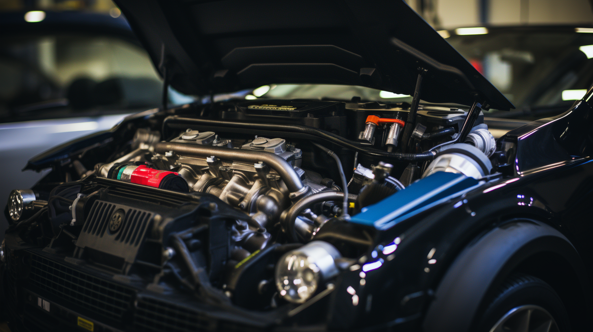
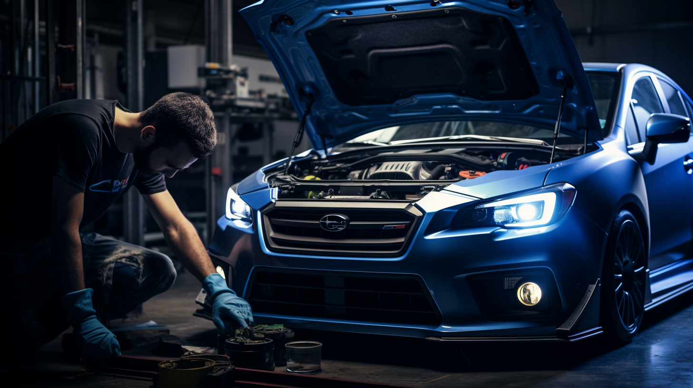

Subaru vehicles are renowned for their symmetrical all-wheel drive, robust boxer engines, and rally heritage. These cars have a cult following, not just for their ability to handle diverse terrains, but also for their immense potential in performance tuning. If you're looking to elevate your Subaru's performance, you've come to the right place. This guide will walk you through the most impactful upgrades that will take your Subaru from street-savvy to track-worthy.

## Turbocharging: The Heartbeat of Performance

The turbocharger is the crown jewel in the world of Subaru performance. It's not just about the boost; it's about how efficiently you can deliver the air-fuel mixture into the combustion chamber. Upgrading to a larger turbo can significantly increase horsepower, but it must be done with precision. It's essential to match the turbo size to your engine's capacity to avoid lag or reliability issues. Consider a twin-scroll turbo for improved response and reduced turbo lag.

## Cold Air Intake: Breathing Life into the Engine

To maximize the efficiency of your turbocharger, your Subaru needs to breathe freely. A cold air intake system draws in cooler, denser air from outside the engine bay, providing a more oxygen-rich mix to the engine. This simple upgrade can improve throttle response and add a few extra horses under the hood. Plus, the distinctive intake sound under acceleration is a bonus that many enthusiasts cherish.

## Exhaust System: The Power of Flow

An upgraded exhaust system does more than just turn heads with its rumble. It's about enhancing the flow of exhaust gases out of the engine, which is crucial for a turbocharged setup. A high-flow, less restrictive exhaust system reduces backpressure, allowing the engine to work more efficiently and produce more power. From cat-back to turbo-back systems, choose one that complements your performance goals and adheres to local noise regulations.

## Suspension: The Art of Sticking to the Road

Power is nothing without control. Subaru's are known for their handling, and the right suspension setup can make your car corner like it's on rails. Upgrading to performance coilovers, sway bars, and strut braces can significantly improve your Subaru's handling characteristics. These upgrades reduce body roll, improve grip, and enhance the overall driving experience, especially in high-speed cornering situations.

## ECU Tuning: The Brain Behind the Brawn

The engine control unit (ECU) is the brain of your Subaru, and tuning it can unlock significant performance gains. Aftermarket ECU tuning can adjust fuel maps, ignition timing, and boost pressure to optimize performance for the upgrades you've installed. It's a critical step that ensures all your performance mods work in harmony, providing safe and reliable power gains.

## Safety First: Brakes and Tires

With great power comes the need for great stopping ability. Don't overlook the braking system when upgrading your Subaru. High-performance brake pads, rotors, and braided brake lines can provide the stopping power needed to match your Subaru's increased performance. Similarly, high-quality performance tires will ensure that all that power translates to traction on the road or track.

## Conclusion: A Symphony of Upgrades

Upgrading a Subaru is about creating a symphony where each part plays in perfect harmony with the others. It's not just about slapping on the biggest turbo you can find or lowering the suspension to the ground. It's about thoughtful modifications that complement each other and enhance the driving experience without sacrificing reliability.

Whether you're a seasoned tuner or a newcomer to the world of performance upgrades, remember that quality parts, professional installation, and proper tuning are the keys to unlocking the true potential of your Subaru. So gear up, hit the road, and let every drive be an exhilarating experience that only a well-tuned Subaru can deliver.

---

Remember, this is a starting point for your blog post. Depending on the depth of content you want to provide, you can expand each section with more detailed information, including specific product recommendations, installation tips, and performance expectations.
